# 第一章 数据类型、运算符与表达式

## 1.字面常量

常量：值不可发生改变的量

常量分为：字面常量、符号常量

整型、实型、字符、字符串

## 2.  标识符和关键字

标识符即为命名;字母、数字、下划线组合，不可数字开头

不可使用关键字

## 3. 符号常量

符号常量：使用标识符去定义的常量

定义语法：命名建议字母大写

```c++
#define 标识符 常量
```

显示中文

```c++
方法一：
#include "windows.h"
int main()
{
	SetconsoleOutputCP(CP_UTF8);
}
方法二：
int main()
{
    system("chcp 65001")
}
```

## 4. 变量的声明和赋值

01：变量的声明

语法： 变量类型 变量名

```c++
int age;
```

02：变量的快速定义

```c++
// 变量声明和赋值同步进行
int num = 10;
//一次性声明多个变量
int a, b, c
a = 10;
b = 10;
c = 10;
```

## 5. 标识符命名规范

常量字母大写

下划线命名法(student_name)：用于变量命名

小驼峰（studentName）：用于变量、函数（方法）

大驼峰(StudentName)：用于类命名

## 6. 数据类型-整型

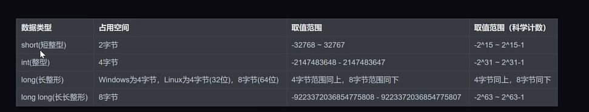

## 7. 无符号和有符号数字

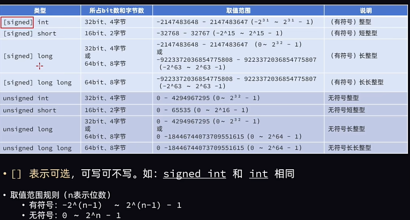

## 8. 数据类型-实型

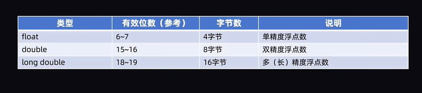

## 9. 常量类型的确定

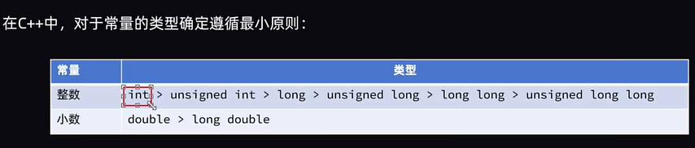

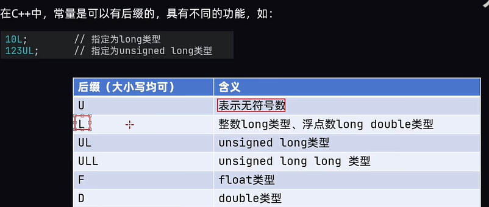

## 10. 数据类型-字符型

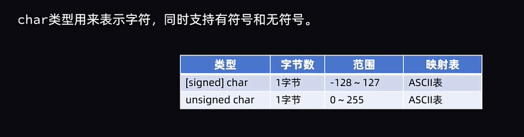

转义字符

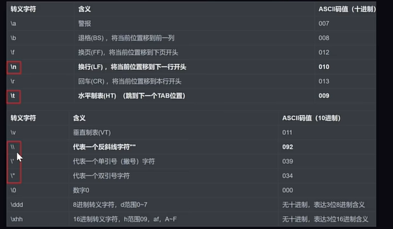

## 11. 数据类型-字符串

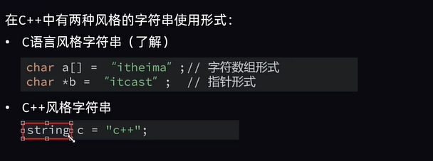

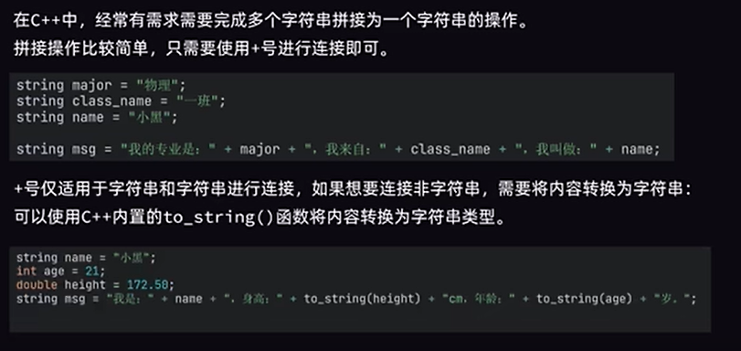

## 12. 数据类型-布尔型

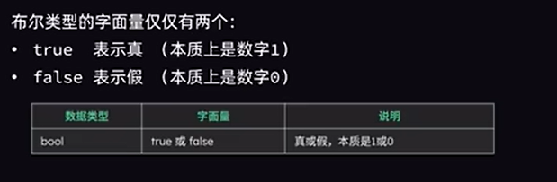

## 13. cin数据输入

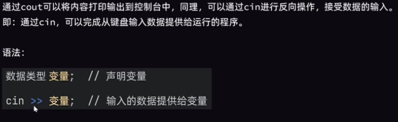

## 14. 算术运算符

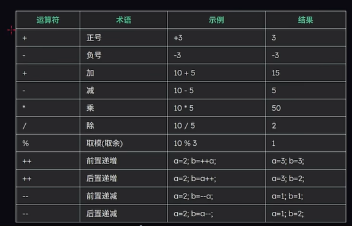

## 15. 赋值运算符

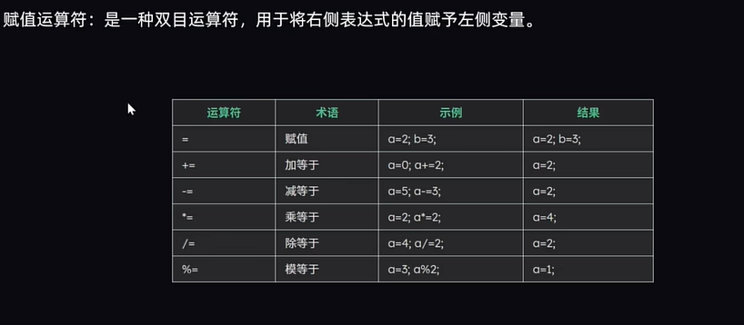

## 16. 比较运算符

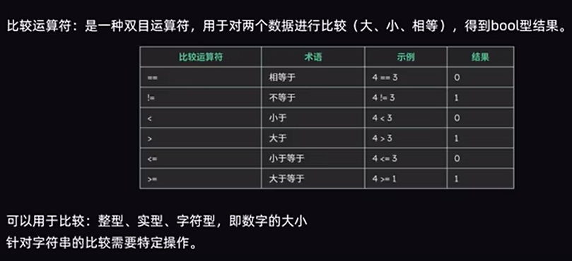

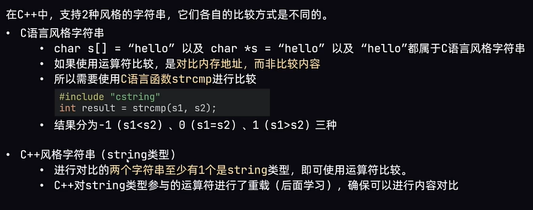

## 17. 逻辑运算符

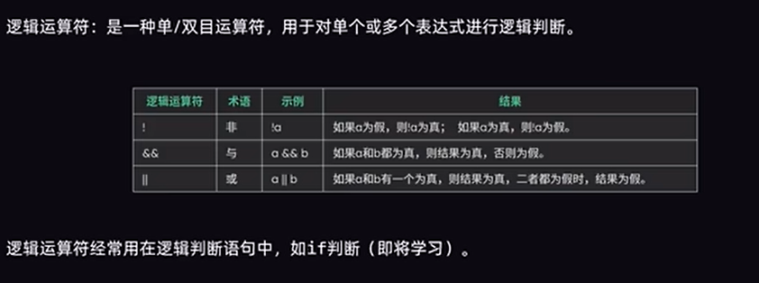

## 18. 三元运算符

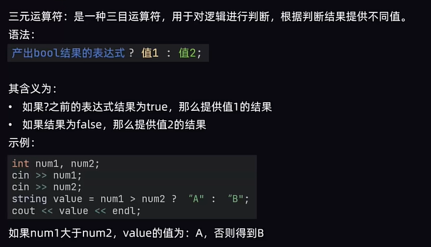
